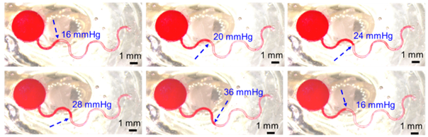
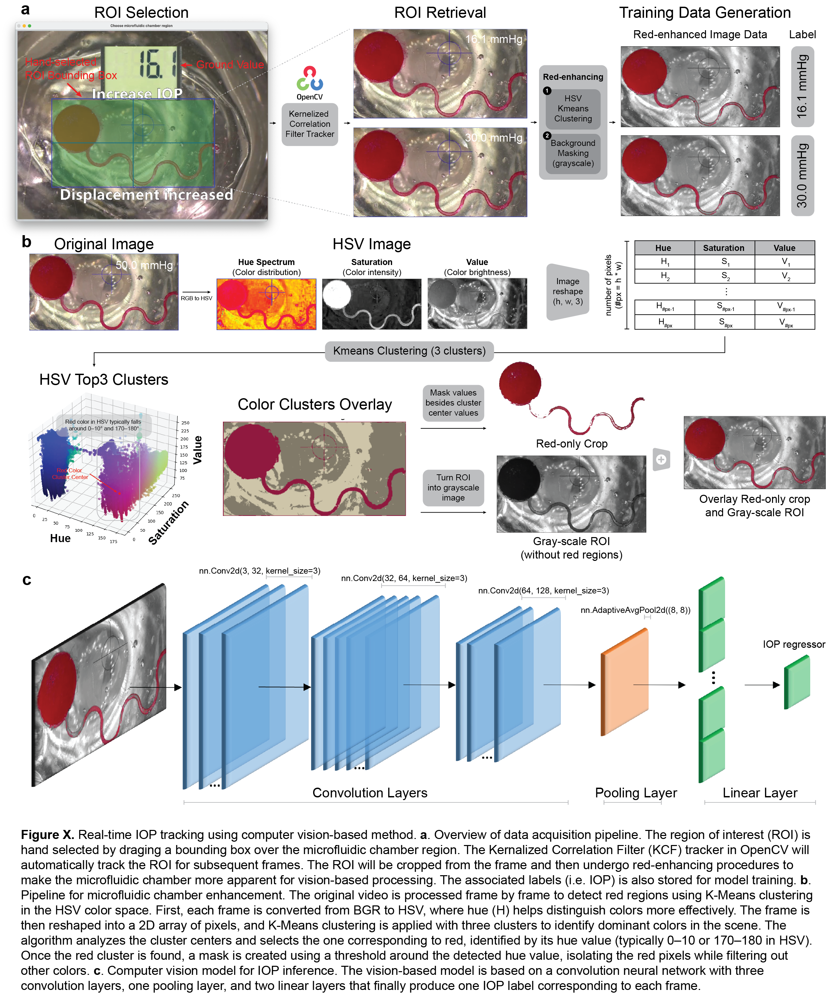

# Microflow-IOP

## TLDR
MicroFlow-IOP is a computer vision-based algorithm designed to analyze intraocular pressure (IOP) by tracking liquid displacement within a microfluidic chamber. By integrating real-time tracking, noise reduction, and robust feature selection, MicroFlow-IOP ensures precise measurement of fluid displacement, which is then mapped to IOP values using a calibrated model. The repository contains camera-ready code for the paper "All-Polymer Theranostic Smart Contact Lens for Monitoring and Programmable Self-Administration of Intraocular Pressure" [](https://doi.org/10.5281/zenodo.17926949)



With potential applications in ophthalmology and biomedical research, MicroFlow-IOP represents a step toward more accessible and automated eye health diagnostics.

The performance demo can be accessed here [YouTube](https://youtu.be/HHLs4mzJsgc).

## Deployment
Change to directory of your project. Create virtual environment and load the dependencies according to `IOP_requirements.txt`.
```
python -m venv [name of virtual environment]
source [name of virtual environment]/bin/activate
pip install -r ./IOP_requirements.txt
cd CNN_based_model/
```
### Data Generation
For replicating the data generation process or for finetuning with your own data, the `data_acquisition.py` script will save each frame of a given close-up device video. Replace the video file name in line 75. The frame-by-frame image data will be saved in a new folder titled "CNN_frame_data".

For reference, data used for the study can be accessed in [this onedrive link](https://terasakilab-my.sharepoint.com/:u:/g/personal/chenshu_liu_terasakicolab_org/Ed7v7QXqAc9ImS0lvQyDK0sB7l9vpXrC9HK0l0pmLvnq5g?e=qoxzFd). Because liquid in the microfluidic chamber is red, we empirically found that enhancing the red color in the frame data would assist with the model performance. Specifically, extract the red chamber region based on HSV values and making the background in grayscale. For reference, the red-enhanced images can be accessed in [this onedrive link](https://terasakilab-my.sharepoint.com/:u:/g/personal/chenshu_liu_terasakicolab_org/EQg4IOc52CdPjbm7wjNNgcgBC22RMALdavSQ2uHjrC650A?e=w5i74c)
```
python data_acquisition.py
python data_acquisition_red_region.py
```

`data_acquisition_red_region.py` is the script for converting the frame data into red-enhanced versions. The script has two options (modify the function argument according to need): turning background into grayscale (`effect == "enhance"`) and completely removing background (`effect == "crop"`).

### Vision-based Model Training & Finetuning
`train_val_split.py` contains the script to create data directory splitted into training and validation folders. `training.py` contains the script to train the vision-based model for pressure prediction.
```
python train_val_split.py
python training.py
```

### Pressure Inference
Run the main.py file in the repository
```
python main.py
```

## Technical Detail Breakdown

